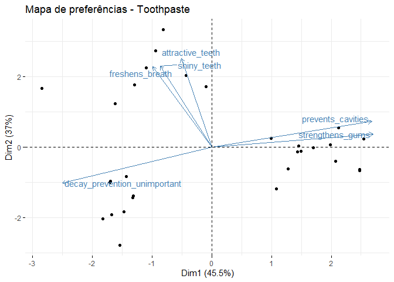
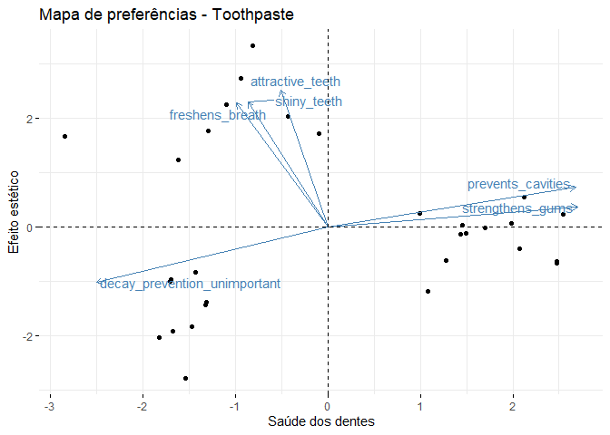
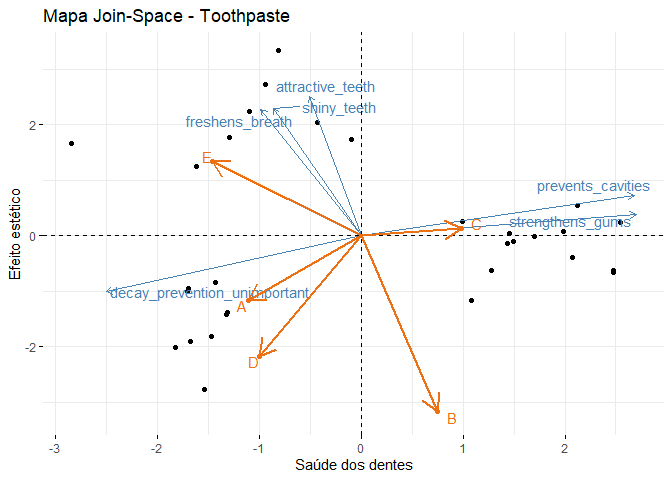
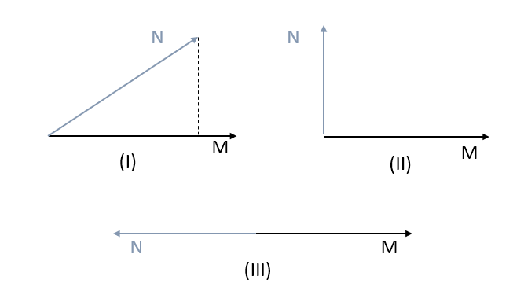

## Posicionamento de marca e preferências dos consumidores

Vivemos em um mundo da informação e somos bombardeados constantemente. Um ponto negativo disso é que cada vez mais a nossa atenção está fragmentada. As marcas sabem disso, e sabem que precisam ser marcantes para que sejam lembradas pelos consumidores. Isto é, elas precisam ser claramente distintas dos concorrentes para que tenham sucesso.

O posicionamento de uma organização na mente do consumidor é resultado de uma estratégia deliberada para desenvolver produtos com características distintas dos seus concorrentes e comunicar essas diferenças aos consumidores. O posicionamento de uma marca é a percepção que os consumidores têm dela.

Ao longo deste *post* vamos abordar algumas ferramentas que podem ajudar as organizações construírem uma estratégia de posicionamento. Levando em conta as preferências dos consumidores, os atributos de seus produtos e como atualmente são vistas no mercado. 

Vamos usar o *R* para mostrar a ferramentas de interesse. Assim, vamos começar carregando os pacotes e as algumas funções que vão nos ajudar:


```r
library(readxl)
library(dplyr)
library(FactoMineR)
library(factoextra)
library(ggplot2)

funcs <- new.env()
source('../functions/functions.R', local = funcs)
```


### Os dados

O *dataset* que será analisado corresponde a um conjunto de dados oriundo de *survey* sobre como os respondentes avaliam as características associadas às marcas de pasta de dentes. A seguir, vamos carregar esses dados e exibir as primeiras observações:


```r
toothpaste <- read_xlsx('../data/toothpaste.xlsx')
toothpaste %>% 
  head() %>% 
  knitr::kable()
```


| consumer| prevents_cavities| shiny_teeth| strengthens_gums| freshens_breath| decay_prevention_unimportant| attractive_teeth| age|gender |
|--------:|-----------------:|-----------:|----------------:|---------------:|----------------------------:|----------------:|---:|:------|
|        1|                 7|           3|                6|               4|                            2|                4|  50|Female |
|        2|                 1|           3|                2|               4|                            5|                4|  27|Female |
|        3|                 6|           2|                7|               4|                            1|                3|  24|Female |
|        4|                 4|           5|                4|               6|                            2|                5|  21|Female |
|        5|                 1|           2|                2|               3|                            6|                2|  34|Female |
|        6|                 6|           3|                6|               4|                            2|                4|  39|Female |

Cada respondente, `consumer`, avalia a importância de seis atributos de creme dental: `prevents_cavities`, `shiny_teeth`, `strengthens_gums`, `freshens_breath`, `decay_prevention_unimportant` e `attractive_teeth`. Além disso, foram registradas as informações sobre idade, `age`, e gênero, `gender` dos respondentes. Cada respondente atribui um valor de 1 a 7 para indicar o quanto acha importante o atributo avaliado, sendo 1 pouco importante e 7 muito importante.

Queremos entender qual as preferências dos indivíduos sobre os atributos de um creme dental. Desta forma, gostaríamos de visualizar o posicionamento de cada respondente em um gráfico. Para fazer isso, vamos reduzir a dimensionalidade dos dados de modo a representar as preferências em gráfico *2D* ou *3D* usando *PCA*. Assim, cada eixo do gráfico será representado por um componente principal obtido a partir do *PCA*.


### PCA - *Principal Components Analysis*

O *PCA* tem como objetivo representar dados que originalmente está em uma alta dimensão em uma dimensão menor. De modo que essa representação consiga manter a maior quantidade possível da variância original dos dados. A regra de ouro é que a representação consiga explicar ao menos $70\%$ da variância original dos dados para seja aceitável.

Deste modo vamos aplicar o *PCA* com 5 componentes principais e observar a o quantos esses componentes explicam a variância dos dados:


```r
teste_componentes <- toothpaste %>% 
  select(-consumer, -age, -gender) %>% 
  as.data.frame() %>% 
  PCA(X = ., graph = FALSE)

teste_componentes$eig %>% 
  knitr::kable()
```


|       | eigenvalue| percentage of variance| cumulative percentage of variance|
|:------|----------:|----------------------:|---------------------------------:|
|comp 1 |  2.7311883|              45.519805|                          45.51981|
|comp 2 |  2.2181193|              36.968654|                          82.48846|
|comp 3 |  0.4415979|               7.359965|                          89.84843|
|comp 4 |  0.3412576|               5.687627|                          95.53605|
|comp 5 |  0.1826282|               3.043804|                          98.57986|
|comp 6 |  0.0852086|               1.420144|                         100.00000|

```r
fviz_eig(teste_componentes, main = 'Contribuição de cada componente')
```


O primeiro componente explica $45,5\%$ da variância dos dados e o segundo componente $36,9\%$, juntos esses componentes explicam mais de $82,4\%$ da variância dos dados. Portanto esses dois componentes são uma representação aceitável dos dados. Dessa forma, vamos aplicar o *PCA* com dois componentes e construir um gráfico *2D*.


```r
pca_2comp <- toothpaste %>% 
  select(-consumer, -age, -gender) %>% 
  PCA(X = ., ncp = 2, graph = FALSE)
```


### Mapa de preferências

O que estamos tentando fazer é representar os seis atributos em termos de dois componentes. O gráfico com a representação das preferências dos respondentes é chamado de mapa de preferências, que mostrar a relação dos respondentes com os atributos avaliados.


```r
fviz_pca_biplot(X = pca_2comp, label = 'var', repel = TRUE) +
  labs(title = 'Mapa de preferências - Toothpaste')
```




Nesse gráfico, os atributos avaliados são representados através das setas e as preferências dos respondentes são representados através dos pontos. Podemos perceber que há três grupos de respondentes de acordo com suas preferências, tem aqueles valorizam bastante os efeitos estéticos das pastas de dentes - próximos dos atributos `attractive_teeth`, `shiny_teeth` e `freshens_breath` -, outros valorizam bastante os efeitos na saúde dental - próximos à `prevents_cavities` e `strengthens_gums` - e aqueles não que consideram a prevenção de caries importante - próximo à `decay_prevention_unimportant`.

A princípio os componentes não possuem nenhuma interpretação. Entretanto, podemos dar algum sentido a eles observando como as variáveis representadas estão correlacionados com eles.


```r
pca_2comp$var$cor %>% 
  knitr::kable()
```


|                             |      Dim.1|      Dim.2|
|:----------------------------|----------:|----------:|
|prevents_cavities            |  0.9283425|  0.2532285|
|shiny_teeth                  | -0.3005297|  0.7952496|
|strengthens_gums             |  0.9361812|  0.1308894|
|freshens_breath              | -0.3415817|  0.7889663|
|decay_prevention_unimportant | -0.8687553| -0.3507939|
|attractive_teeth             | -0.1766389|  0.8711581|

Podemos ver que os atributos `prevents_cavities`, `strengthens_gums` e `decay_prevention_unimportant` estão bastantes correlacionados com o primeiro componente e os atributos `shiny_teeth`, `attractive_teeth` e `freshens_breath` estão bastante correlacionados com a segundo. Assim, a primeira dimensão pode ser interpretada como a importância dada aos efeitos sobre a saúde dental e a segunda dimensão pode ser interpretada como importância dada à efeitos estéticos sobre os dentes.

Dessa forma, podemos representar o mapa de preferências como:


```r
map_prefer <- fviz_pca_biplot(X = pca_2comp, label = 'var', repel = TRUE) +
  labs(x = 'Saúde dos dentes', y = 'Efeito estético', title = 'Mapa de preferências - Toothpaste')
map_prefer
```




Do ponto de vista de negócios, uma grande implicação do gráfico acima é a segmentação dos clientes a partir de seus gostos e a possibilidade de criar produtos diferenciados, direcionados a segmentos específicos. Assim, uma marca pode desenvolver dois produtos: um direcionados a clientes que se preocupa mais com a estética e outro com clientes que se preocupam mais com a saúde dos dentes e comunicar isso através de um marketing diferenciado.

### Posicionamento e mapas *join-space*

Outro fator complementar às preferências dos clientes é o posicionamento da marca. O posicionamento de uma marca é entendido como a percepções que os clientes têm da marca. Por exemplo, uma marca *A* de creme dental pode ser percebida como uma marca cujo produtos estão associados à melhora da saúde bucal, enquanto a marca *B* pode ser percebida como aquela em que os uso dos produtos levem à dentes brilhantes.

Dessa forma, o posicionamento de uma marca pode ser entendido como um esforço que a marca empreende para diferenciar-se em relação aos demais concorrentes e associar os seus produtos a determinados atributos. Considerando o atual momento em que os clientes são bombardeados por informações, um posicionamento que produza uma diferenciação clara da marca é essencial para o sucesso de qualquer negócio.

Até o momento tratamos das preferências dos clientes, entretanto, não falamos como os consumidores percebem a marca. Esclarecendo essa questão, poderemos entender qual o posicionamento de uma marca, como ela se posiciona em relação a seus competidores e se há espaço para novos posicionamentos e produtos.

Agora, vamos trabalhar com um conjunto de dados simulado acerca da percepção dos respondentes sobre os produtos de algumas empresas sob os mesmos atributos de quando falamos sobre preferências. Os dados por ser visto as seguir:


```r
empresas <- read.csv2('../resultados/empresas-04.csv', stringsAsFactors = FALSE)
empresas %>% 
  knitr::kable()
```


|empresas | prevents_cavities| shiny_teeth| strengthens_gums| freshens_breath| decay_prevention_unimportant| attractive_teeth|
|:--------|-----------------:|-----------:|----------------:|---------------:|----------------------------:|----------------:|
|A        |               1.4|         4.4|              4.6|             5.2|                          5.4|              1.0|
|B        |               1.2|         2.0|              4.6|             1.4|                          1.8|              1.0|
|C        |               6.0|         2.6|              3.8|             5.8|                          1.8|              3.2|
|D        |               2.2|         3.0|              2.6|             2.4|                          5.6|              2.6|
|E        |               3.6|         7.0|              3.6|             6.6|                          5.4|              2.8|

Cada linha representa uma empresa e os dados são a média de avaliação para cada atributos. 

Poderíamos construir um gráfico semelhante ao mapa de preferências para a percepções dos respondentes sobre as empresas, esse tipo de gráfico é conhecido como mapa perceptual. Ele mostra informações muito importantes como, posicionamento relativo entre as marcas e uma compreensão dos atributos que forma o posicionamento. Entretanto, ele não permite responder as seguintes perguntas: o posicionamento é adequado dado as preferências dos consumidores? Existe um nicho mercado que não está sendo aproveitado?

Uma estratégia é unir os dois tipos de gráficos para responder a essas perguntas e aproveitar os benefícios dos mapas de preferências e mapas perceptuais. Esse tipo de gráfico é conhecido como mapas *Join-Space*. 

A seguir criamos um gráfico desses, que junta as preferências dos respondentes e suas percepções sobre as empresas no mercado. De modo geral, representamos as avaliações das empresas em termos das duas dimensões obtidos para os dados sobre preferências. Após isso, adicionamos as representações ao mapa de preferências.


```r
repre <- funcs$new_predict(pca_2comp, empresas, 'empresas')
labels_emp <- names(repre)
funcs$add_empresas(gp = map_prefer, empresas = labels_emp, coordenadas = repre) +
  labs(title = "Mapa Join-Space - Toothpaste")
```



No gráfico acima, os atributos são representados pelas setas em azul, as preferências dos respondentes são representadas pelos pontos e as percepções sobre as empresas são representadas pelas setas em vermelho. Assim, vemos o posicionamento das empresas *A, B, C, D* e *E* assim como a preferência dos consumidores.

A marca *E* é principalmente percebida como tendo produtos que impactam na aparência dos dentes e que não tem muita preocupação sobre a saúde. Já a marcas *A* e *D* são percebidas como tendo produtos que não têm preocupação com a saúde dos dentes e que têm efeito estéticos. A marca *C* é vista como tendo produtos que têm efeito principalmente na saúde dos dentes. Por fim, a marca *B* é percebida principalmente como não tendo efeito estético negativo sobre os dentes e com pouco efeito sobre a saúde dental.

Essas conclusões foram determinadas a partir das relações entre os vetores que representam a os atributos e os vetores que representam as percepções sobre as marcas. Tais relações são mostradas a seguir:



No primeiro $(I)$ caso, o vetor *M* e *N* possuem alguma semelhança entre si, o grau com que *M* é semelhante com *N* é medida pela projeção ortogonal de *N* sobre *M*, isto é, a "sombra" de *N* sobre *M*. No segundo caso $(II)$, *M* e *N* não possuem nenhuma relação entre si e por fim no caso $(III)$ os vetores possuem relação opostas. Além disso, o tamanho da seta/vetor indica a intensidade do atributo/percepção representado.

Agora que já sabemos como interpretar os atributos e sua relação com o posicionamento, vamos passar falar sobre posicionamento relativo entre as marcas e a adequação do posicionamento às preferências.

As marcas *A* e *D* possuem posicionamento bem semelhantes, isso significa que não há uma distinção clara entre ambas para os respondentes. Dessa forma, essas marcas são competidoras diretas. 

As demais marcas possuem posicionamentos distintos. A marca *E* poderia melhorar seu posicionamento reforçando qualidades como `shiny_teeth` e `attractive_teeth` de modo a alcançar melhor as preferências dos consumidores nesse segmento. A marca *C* poderia melhorar seu posicionamento tonando mais intenso a percepção de cuidado com saúde bucal.

Já a marca *D* possui um péssimo posicionamento. Ela é vista como uma marca cujo produto tem efeito oposto à boa aparência nos dentes. E nesse sentido não há mercado para ela. Uma foram de melhorar sua percepção é mudar seu posicionamento para uma marca que se preocupa com saúde bucal e competir com a marca *C*. 

Por fim, não há segmento de mercado que não é atendido dada as preferências dos respondentes e o posicionamento das empresas. Isso ocorreria se houvesse um segmento de clientes com preferências que não se aproximasse de nenhum posicionamento das marcas.

### Considerações

As ferramentas apresentadas até aqui são poderosos instrumentos para se formular estratégias de posicionamento e até mesmo formular novos produtos. Além disso, elas possuem uma larga aplicação. Um campo particularmente promissor em aplicação é o marketing político. Por exemplo, no caso de eleições majoritárias, os candidatos podem ser compreendidos como marcas e as suas propostas como atributos a serem avaliados pelos eleitores.

Naturalmente que esta pequena explanação toca em uma pequena parte sobre o que é posicionamento de marcas e marketing analítico.

### Bibibliografia consultada

-------

* Lilien, Gary & Rangaswamy, Arvind & De Bruyn, Arnaud. (2013). Principles of Marketing Engineering. 
* Malhotra, Naresh K. Marketing research : an applied orientation — 6th ed. Pearson.
* LÊ, Sébastien; JOSSE, Julie; HUSSON, François. FactoMineR: An R Package for Multivariate Analysis. Journal of Statistical Software, [S.l.], v. 25, Issue 1, p. 1 - 18, mar. 2008. ISSN 1548-7660. Available at: <https://www.jstatsoft.org/v025/i01>. Date accessed: 28 july 2020. doi:http://dx.doi.org/10.18637/jss.v025.i01.


